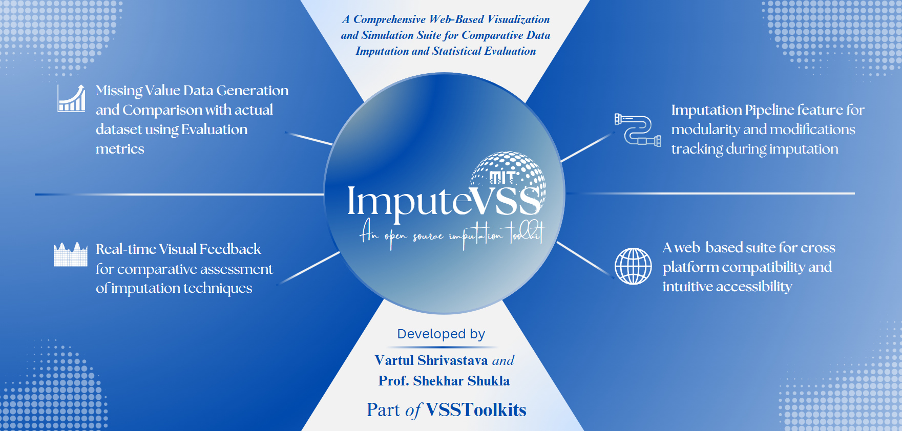

# Impute-VSS: A Comprehensive Web-Based Visualization and Simulation Suite for Comparative Data Imputation and Statistical Evaluation

## Overview
Impute-VSS is a web-based solution engineered to address the intricate challenges of data imputation. This tool offers a unified interface combining multiple imputation techniques, including traditional statistical methods and machine learning–based algorithms, along with modular pipeline capabilities. Designed for both researchers and practitioners, Impute-VSS enables analytical exploration of missing data, comparative assessments of imputation methods, and detailed visual diagnostics to support data-driven decision-making.

---

## Features

1. **Comprehensive Imputation Techniques**:
   - **Complete Case Analysis (CCA)**: Analyze datasets by excluding incomplete records.
   - **Univariate Imputation**: Employ statistical techniques like Mean, Mode, Median, Constant Value, and Random Sample Imputation for simplicity and speed.
   - **Multivariate Imputation**: Integrate advanced methods such as K-Nearest Neighbors (KNN) and Multiple Imputation by Chained Equations (MICE) for datasets with complex interdependencies.
   - **Machine Learning–Based Imputation**: Utilize algorithms like Gradient Boosting, Random Forest Regressor, and Support Vector Regression to predict missing values based on the overall dataset context.

2. **Real-time Visual Feedback**:
   - **Interactive Charts**: Heatmaps, KDE Plots, Histograms, Correlation Matrices, and Box Plots to dynamically visualize imputation outcomes.
   - **Comparative Analysis**: Instant updates showcasing differences across techniques and their statistical significance.

3. **Imputation Pipeline Management**:
   - Create modular workflows and export them in the proprietary `.impvss` format for consistent replication and sharing.
   - Ensure efficient reuse of imputation strategies without compromising dataset privacy.

4. **Cross-Platform Compatibility**:
   - Fully web-based, compatible with desktops, tablets, and mobile devices for seamless accessibility across platforms.

5. **Statistical Metrics and Comparisons**:
   - Evaluate methods based on Kernel Density Estimation (KDE) overlap, Skewness, Kurtosis, Kolmogorov-Smirnov Statistic, and Kullback-Leibler Divergence for robust statistical insights.

---

## Installation

1. **Clone the Repository**:
   ```bash
   git clone https://github.com/vartul-shrivastava/ImputeVSS-16012025.git
   cd ImputeVSS-16012025
2. **Install Dependencies**: Ensure you have Python 3.12.3 or above installed. Then run:
   ```bash
      pip install -r requirements.txt
3. **Run the Application**: Start the Flask application by executing:
   ```bash
      python app.py
4. **Access Impute-VSS Dashboard**: Open your web browser and navigate to http://127.0.0.1:5000 (or the specified port) to view the Impute-VSS dashboard.

# Packages Requirements
Kindly install these packages through requirements.txt to run the Impute-VSS application. These packages support functionalities such as web serving, numerical computations, data manipulation, machine learning, and system monitoring.

1. Flask
2. pandas
3. numpy
4. scikit-learn
5. scipy
6. beautifulsoup4
7. psutil

## Troubleshooting

- **Installation Issues**:
  - *Error during `pip install -r requirements.txt`:*
    - **Solution**: Ensure you are using Python 3.12.3 or above. Upgrade pip using `pip install --upgrade pip` and retry installation. Also, verify your network or proxy settings if package downloads fail.

- **Port Conflicts**:
  - *Flask fails to start due to a port conflict:*
    - **Solution**: Modify the default port in `app.py` by changing `app.run()` to `app.run(port=5001)` (or another available port). Ensure no other process is using the specified port.

- **Module Import Errors**:
  - *Encountering `ModuleNotFoundError` or `ImportError`:*
    - **Solution**: Confirm all dependencies are installed correctly. Re-check the `requirements.txt` for any missing packages and install them manually if necessary.

- **Browser Rendering Issues**:
  - *Dashboard not displaying correctly or missing visual elements:*
    - **Solution**: Clear your browser cache, try using another browser (such as Chrome, Firefox, or Edge), and ensure that JavaScript is enabled in your browser settings.

- **General Debugging**:
  - Review the terminal or console for error messages when running the application.
  - Verify that the file structure is complete and that all required files (CSS, JavaScript, HTML templates) are in their correct directories.
  - Restart the application after making any configuration or source file modifications.


## File Structure
```
├── static/
│   ├── css/          # Stylesheet
│   ├── images/       # Backgrounds and logos
│   ├── js/           # JavaScript file
├── templates/        # HTML template
├── app.py            # Flask application
├── requirements.txt  # Dependencies
├── README.md         # Documentation
```

## Support
- **Author Emails**: 
  - Vartul Shrivastava: vartul.shrivastava@gmail.com
  - Prof. Shekhar Shukla: shekhars@iimidr.ac.in

## License
Impute-VSS is licensed under the MIT License. See the LICENSE file for more details.